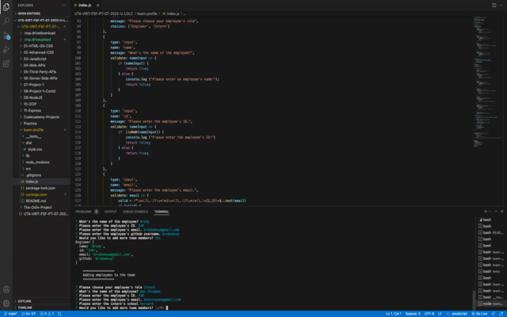

# Team Profile Generator

This application was created to generate a team profile based on user input using the Inquirer module from Node.js and displaying the information on a newly created html page with a style sheet. This project helped me expand my knowledge of OOP and testing.

## Table of Contents 

- [Installation](#installation)
- [Usage](#usage)
- [Credits](#credits)
- [License](#license)

## Installation

The user should clone the repository from GitHub and download Node. This application also requires a file system and inquirer module. If testing is required, this application uses Jest.

## Usage

* Use the inquirer command line to answer the questions that are prompted and then to the `dist` folder and open the `index.html` file.   

## Credits

Stack Overflow

## License

🏆 The previous sections are the bare minimum, and your project will ultimately determine the content of this document. You might also want to consider adding the following sections.

## Badges

